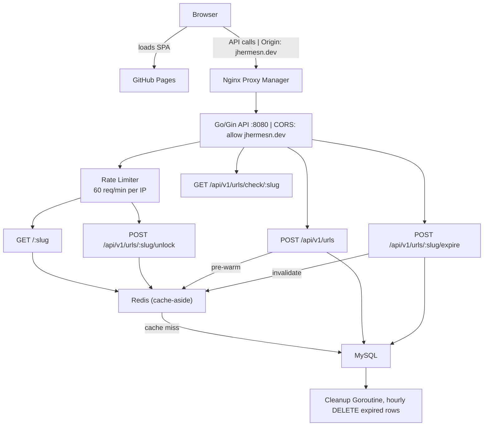
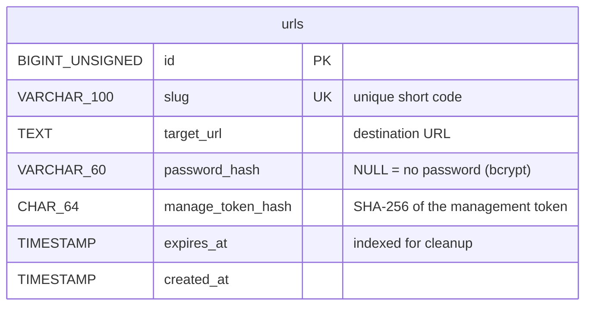
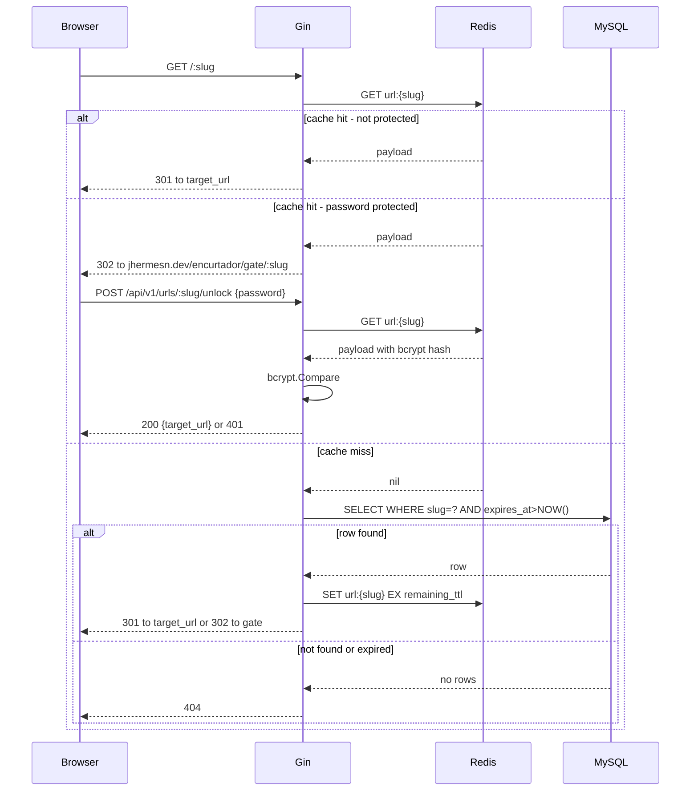
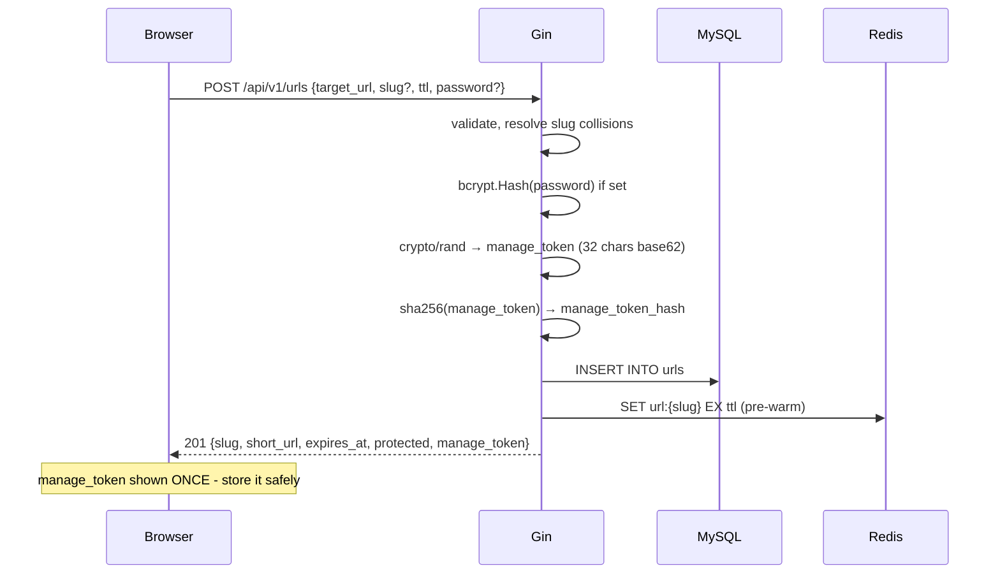
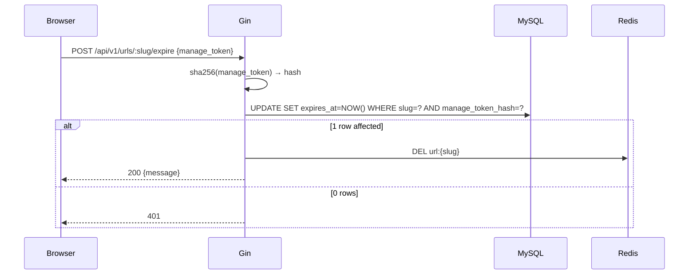

# Encurtador

A fast, self-hosted URL shortener written in Go with a React front-end hosted on GitHub Pages.
The Go service runs as a single Docker container (MySQL and Redis are expected to already be available on the host).

## Features

- **Custom slugs** -> choose your own readable short code (5–50 chars) or let the system generate an 8-character random one
- **TTL options** -> links expire after 1 hour, 1 day, 1 week, 1 month, or 1 year
- **Password protection** -> optional bcrypt-hashed password gates access to the redirect
- **Management tokens** -> each link gets a one-time management token; use it to expire the URL early
- **Cache-aside** -> Redis sits in front of MySQL; the redirect hot path almost never hits the database
- **Rate limiting** -> redirect and password-unlock endpoints are capped at 60 requests/minute per IP
- **No account required** -> open panel, anyone can create a link

---

## Architecture

I use NGINX Proxy Manager due to my infrastructure security, but you can host the api anywhere you want.

The **React SPA is hosted on GitHub Pages** at `https://jhermesn.dev/encurtador/` and talks to the Go API via CORS.
MySQL and Redis run locally on the host and are reachable via `network_mode: host` inside Docker.

### Logs → Loki using my [homelab infrastructure](https://github.com/jhermesn/homelab-infra?tab=readme-ov-file)

Promtail is configured to scrape containers with the label `logging=promtail` and ship their stdout to Loki.
`docker-compose.yml` sets:

- `logging=promtail`
- `service=encurtador`

The server logs as JSON via `slog` and emits a `timestamp` field so Promtail can parse and label logs consistently.

---

## Database Model

The schema is created automatically on first startup via an idempotent `CREATE TABLE IF NOT EXISTS`.

### Query performance

| Query | Index used | Notes |
|---|---|---|
| `SELECT ... WHERE slug = ? AND expires_at > NOW()` | UNIQUE on `slug` | B-tree point lookup, dominant hot path, almost always served by Redis |
| `SELECT EXISTS(SELECT 1 WHERE slug = ?)` | UNIQUE on `slug` | availability check |
| `INSERT INTO urls ...` | UNIQUE on `slug` | single-row write |
| `UPDATE ... SET expires_at = NOW() WHERE slug = ?` | UNIQUE on `slug` | early expire, rare |
| `DELETE WHERE expires_at < NOW()` | INDEX on `expires_at` | hourly batch cleanup |

---

## Request Flows

### Redirect (hot path)

### URL Creation

### Early Expire

---

## API Reference

| Method | Path | Body | Response |
|---|---|---|---|
| `POST` | `/api/v1/urls` | `{target_url, slug?, ttl, password?}` | `201 {slug, short_url, expires_at, protected, manage_token}` |
| `GET`  | `/api/v1/urls/check/:slug` | - | `200 {available, suggestion?}` |
| `GET`  | `/:slug` | - | `301` redirect, `302` to frontend gate page, or `404` |
| `POST` | `/api/v1/urls/:slug/unlock` | `{password}` | `200 {target_url}` or `401` |
| `POST` | `/api/v1/urls/:slug/expire` | `{manage_token}` | `200` or `401` |

**TTL values:** `1h` · `24h` · `168h` · `720h` · `8760h`

Rate limiting (60 req/min per IP, shared counter across redirect + unlock) applies to `GET /:slug` and `POST /api/v1/urls/:slug/unlock`. Exceeding the limit returns `429`.

---

## Environment Variables

### Backend (`api/.env`)

| Variable | Required | Default | Description |
|---|---|---|---|
| `MYSQL_DSN` | ✓ | - | MySQL DSN, e.g. `user:pass@tcp(127.0.0.1:3306)/encurtador?parseTime=true` |
| `REDIS_ADDR` | ✓ | - | Redis address, e.g. `127.0.0.1:6379` |
| `BASE_URL` | ✓ | - | Public base URL without trailing slash, e.g. `https://encurtador.jhermesn.dev` |
| `APP_PORT` | - | `8080` | Port to listen on |
| `CORS_ALLOWED_ORIGIN` | - | `https://jhermesn.dev` | Origin allowed to make cross-origin requests |
| `FRONTEND_URL` | - | `https://jhermesn.dev/encurtador` | Frontend base path; used when redirecting to the password gate |

### Frontend (`web/.env`)

| Variable | Required | Description |
|---|---|---|
| `VITE_API_URL` | ✓ | Backend API base URL, e.g. `https://encurtador.jhermesn.dev` |

---

## Some Notes

- **Link passwords** use bcrypt. The hash is stored in MySQL and cached in Redis; the plain-text password is never persisted.
- **Management tokens** are 32-character cryptographically random base62 strings generated with rejection sampling to eliminate modulo bias. Only the SHA-256 hash is stored - the plain token is returned once at creation time.
- **Auto-generated slugs** use `crypto/rand` with 8 base62 characters (~218 trillion combinations), making enumeration impractical.
- **Rate limiting** (60 req/min per IP, shared counter across redirect + unlock) stops real-time brute-force attacks.
